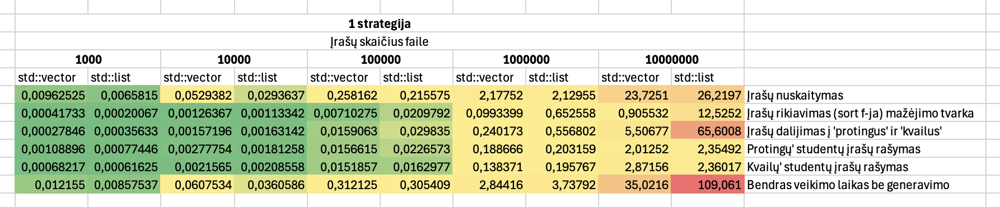
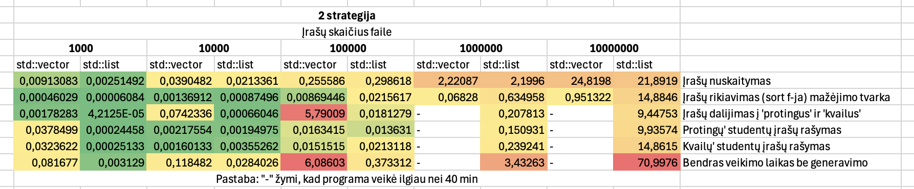
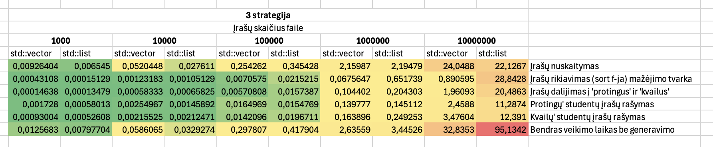
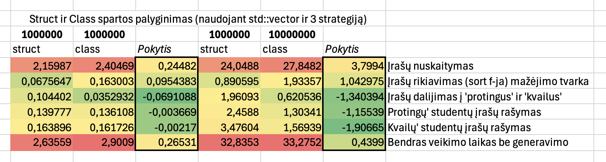
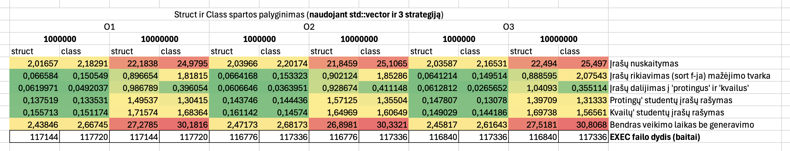

### Programos naudojimo instrukcija

1. Atsisiųsti v1.0 release paketą ir CMAKE 3.25 versiją;
2. Atsidaryti terminalą ir jame pakeisti dabartinę direktoriją į atsisiųsto (un-zip'into) kodo aplanką ("cd ./objektinis-pirma-obj-4" ar panašiai);
3. Terminale paleisti run.sh script'ą su komanda "./run.sh". *PASTABA*: jeigu nepavyksta, panaudoti komandą "chmod +x run.sh";
4. Programai pasileidus, skaityti ekrane pasirodžiusias instrukcijas ir jomis vadovautis.

### Testavimo įranga:
- CPU: Apple M1
- RAM: 8 GB LPDDR4X-4266
- SSD: 256 GB ~2700 MB/s

### Programos versijų aprašas ir spartos analizė

#### Versija 0.1

- Generuoja studentų informaciją: namų darbai ir egzamino rezultatai
- Leidžia duomenis įvesti rankomis arba nuskaityti iš failo
- Informacija išvedama į failą sulygiuota ir išrikiuota pagal pavardę

Panaudotos bibliotekos: iostream, vector, sstream, random, algorithm, fstream, iomanip, stdexception.

#### Versija 0.2

- Generuoja studentų informaciją: namų darbai ir egzamino rezultatai
- Leidžia duomenis įvesti rankomis arba nuskaityti iš failo
- Informacija išvedama į failą sulygiuota ir išrikiuota pagal pavardę
- *Studentus suskirsto į "protingus" ir "kvailus" ir juos išveda į atskirus failus*

Panaudotos bibliotekos: iostream, vector, sstream, random, algorithm, fstream, iomanip, stdexception, chrono.

#### Versija 0.3

- Generuoja studentų informaciją: namų darbai ir egzamino rezultatai
- Leidžia duomenis įvesti rankomis arba nuskaityti iš failo
- Informacija išvedama į failą sulygiuota ir išrikiuota pagal pavardę
- Studentus suskirsto į "protingus" ir "kvailus" ir juos išveda į atskirus failus
- *Fiksuoja programos spartos laiką vector ir list konteineriams: įrašų generavimas, nuskaitymas, rikiavimas, studentų įrašų išskirtymas į "protingus" ir "kvailus"*

Panaudotos bibliotekos: iostream, vector, sstream, random, algorithm, fstream, iomanip, stdexception, chrono, list.

#### Versija 1.0

- Generuoja studentų informaciją: namų darbai ir egzamino rezultatai
- Leidžia duomenis įvesti rankomis arba nuskaityti iš failo
- Informacija išvedama į failą sulygiuota ir išrikiuota pagal pavardę
- Studentus suskirsto į "protingus" ir "kvailus" ir juos išveda į atskirus failus
- Fiksuoja programos spartos laiką vector ir list konteineriams: įrašų generavimas, nuskaitymas, rikiavimas, studentų įrašų išskirtymas į "protingus" ir "kvailus"
- *Studentų įrašų duomenis galima apdoroti pagal 3 skirtingas strategijas: (1) padalinti į naujus 2 konteinerius, (2) padalinti sukuriant tik 1 naują konteinerį, (3) taikant greičiausią būdą ir pritaikant efektyvius STL algoritmus*

Panaudotos bibliotekos: iostream, vector, sstream, random, algorithm, fstream, iomanip, stdexception, chrono, list, numeric.

#### Versija 1.1

### Struct ir Class veikimo palyginimas

### O1, O2 ir O3 optimizavimo flag'ų palyginimas

#### Versija 1.2

Įvedimo ir išvedimo member metodai class'ei Studentas buvo perdengti. Įvedimo metodas pilnai nuskaito duomenų eilutę sugeneruotame faile (vardas, pavardė ir visi gauti įvertinimai). Kai kuriais atvejais įvedimo metodas rankinio įvedimo metu nepanaudotas dėl skirtingų duomenų reikalavimų. Išvedimo metodas taip pat pritaikytas, nebent prašoma išvesti skirtigus duomenis (pvz. prašo vidurkio ir medianos, o metodas išveda tik vieną).