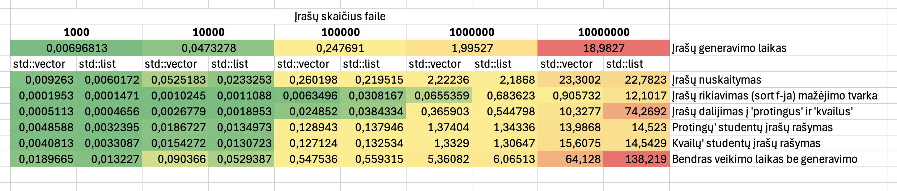
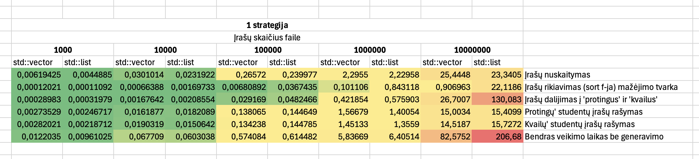
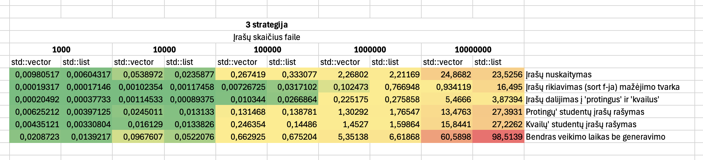

### Programos naudojimo instrukcija

1. 

### Testavimo įranga:
- CPU: Apple M1
- RAM: 8 GB LPDDR4X-4266
- SSD: 256 GB ~2700 MB/s

### Programos versijų aprašas ir spartos analizė

#### Versija 0.1

- Generuoja studentų informaciją: namų darbai ir egzamino rezultatai
- Leidžia duomenis įvesti rankomis arba nuskaityti iš failo
- Informacija išvedama į failą sulygiuota ir išrikiuota pagal pavardę

Panaudotos bibliotekos: iostream, vector, sstream, random, algorithm, fstream, iomanip, stdexception.

#### Versija 0.2

- Generuoja studentų informaciją: namų darbai ir egzamino rezultatai
- Leidžia duomenis įvesti rankomis arba nuskaityti iš failo
- Informacija išvedama į failą sulygiuota ir išrikiuota pagal pavardę
- Studentus suskirsto į "protingus" ir "kvailus" ir juos išveda į atskirus failus

Panaudotos bibliotekos: iostream, vector, sstream, random, algorithm, fstream, iomanip, stdexception, chrono.

#### Versija 0.3

- Generuoja studentų informaciją: namų darbai ir egzamino rezultatai
- Leidžia duomenis įvesti rankomis arba nuskaityti iš failo
- Informacija išvedama į failą sulygiuota ir išrikiuota pagal pavardę
- Studentus suskirsto į "protingus" ir "kvailus" ir juos išveda į atskirus failus
- Fiksuoja programos spartos laiką vector ir list konteineriams: įrašų generavimas, nuskaitymas, rikiavimas, studentų įrašų išskirtymas į "protingus" ir "kvailus"

Panaudotos bibliotekos: iostream, vector, sstream, random, algorithm, fstream, iomanip, stdexception, chrono, list.

#### Versija 1.0

- Generuoja studentų informaciją: namų darbai ir egzamino rezultatai
- Leidžia duomenis įvesti rankomis arba nuskaityti iš failo
- Informacija išvedama į failą sulygiuota ir išrikiuota pagal pavardę
- Studentus suskirsto į "protingus" ir "kvailus" ir juos išveda į atskirus failus
- Fiksuoja programos spartos laiką vector ir list konteineriams: įrašų generavimas, nuskaitymas, rikiavimas, studentų įrašų išskirtymas į "protingus" ir "kvailus"
- Studentų įrašų duomenis galima apdoroti pagal 3 skirtingas strategijas: (1) padalinti į naujus 2 konteinerius, (2) padalinti sukuriant tik 1 naują konteinerį, (3) taikant greičiausią būdą pritaikant efektyvius STL algoritmus

Panaudotos bibliotekos: iostream, vector, sstream, random, algorithm, fstream, iomanip, stdexception, chrono, list.

